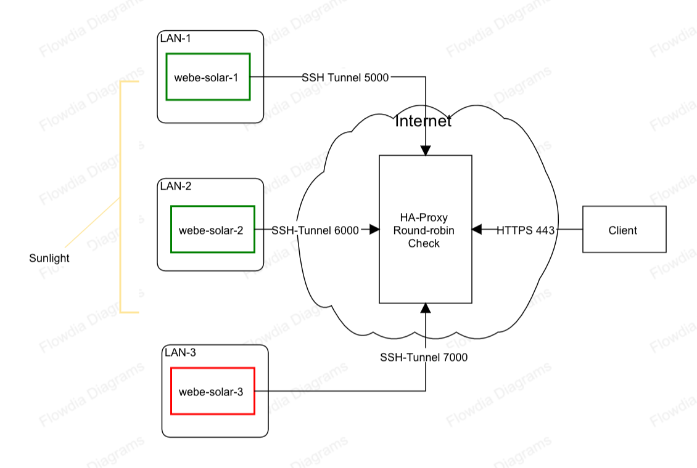

# WebE Project Journal

## 01032022

Beginning work on the [solar](./solar)-powered project.

### Hardware

5VDC [Solar Panel](https://www.dfrobot.com/product-1775.html)l -> DFRobot [Solar Power Manager 5V](https://wiki.dfrobot.com/Solar_Power_Manager_5V_SKU__DFR0559) -> [Rock64](https://wiki.pine64.org/wiki/ROCK64)

### Software 

1. Burn Armbian to SD card
2. Connect serial console cable
  + `picoterm /dev/ttyUSB0 -b1500000`
3. Boot & run-through initial setup
  + Personal -> Hostname -> `webe-solar.local`
  + System -> CPU -> set min and max speed to slowest option, conservative governor
4. `reboot`
5. Install JSFS
  + `sudo apt install git, vim, nodejs, npm`
  + `git clone https://github.com/jjg/jsfs.git`
  + Walk-through the [configuration steps](https://github.com/jjg/jsfs#configuration) in the README

At this point we can sucessfully make JSFS requests.

There was just enough sunlight to perform this initial test on actual solar power.  What's needed next to run this safely is a way to shut-down cleanly when the sun goes away.  Sadly the charge controller board doesn't have any output to indicate the charging state or amount of energy left in the battery, so this will require some hacking.

My initial thought is to "hijack" the line connected to the `CHG` and `DONE` LEDs, and feed this to the GPIO on the SBC.  There would need to be some logic to determine if the sun has gone away and to initiate shutdown while power remains in the battery.  I think it would work like this:

| CHG | DONE | OUT  | 
|-----|------|------|
| ON  | OFF  | HIGH |
| ON  | ON   | HIGH |
| OFF | ON   | HIGH |
| OFF | OFF  | LOW  |

I'm not sure if I want to implement this logic externally or bring both signals back to the SBC and do the logic there.  The former seems like the right thing to do, but the latter seems simpler (less electronics work, more software work).  I guess it will come down to how much hacking I have to do to get at the signals (if I have to a lot of soldering to just get the signal it might not be much more work to implement the logic at the same time).

Software-wise the next thing we can do is open-up access to the node to the public Internet.  The most reliable way to do this is to use an ssh tunnel, so let's give that a try.

1. Create a new ssh key on webe-solar: `ssh-keygen`
2. Copy the key to some server on the public Internet
3. Open a tunnel on webe-solar: `ssh -N -i /home/jason/.ssh/id_rsa_tunnel jason@theneuromantics.net -R 2022:localhost:7302 -C`
4. Test the connection from the Internet server: `curl -v http://localhost:2022/`
5. Make sure Gateway Ports: yes in /etc/ssh/sshd_config
6. Make sure the port isn't blocked by the firewall
  + `iptables -I INPUT -p tcp --dport 2022 -m conntrack --ctstate NEW,ESTABLISHED -j ACCEPT`
    + TODO: Make this persistent once a persistent host is chosen
7. Test connection from the public internet: `curl -v http://68.183.206.69:2022/`
8. Automate!
  + `sudo apt install autossh`
  + Connect with `autossh` from root once to establish key validity, etc: `sudo autossh -M 20000 -N -i /home/jason/.ssh/id_rsa_tunnel jason@theneuromantics.net -R 2022:localhost:7302 -C`
  + Create systemd service file
  + `sudo systemctl daemon-reload`
  + `sudo systemctl start jsfs-tunnel`
  + Test connecting from the public Internet
  + `sudo systemctl enable jsfs-tunnel`
  + TODO: Create service file to start `jsfs` and *then* start `jsfs-tunnel`

OK, at this point I have both JSFS and the tunnel starting automatically at boot.  Once I hack the electronics to tell the SBC the sun is gone (and write a script to read this and shut the SBC down) we should be really close to making this usable for some testing.

...well there is also the matter of booting things back up when the sun comes back.  Hmm...

For now I've exposed an experimental website at [solar.jasongullickson.com](http://solar.jasongullickson.com:2022/index.html) (which reminds me, it would be nice if jsfs handled default documents...).


### References

* https://wiki.dfrobot.com/Solar_Power_Manager_5V_SKU__DFR0559
* https://wiki.pine64.org/wiki/ROCK64#Expansion_Ports
* https://armbian.tnahosting.net/dl/rock64/archive/
* https://github.com/jjg/jsfs
* https://medium.com/gowombat/tutorial-how-to-use-ssh-tunnel-to-expose-a-local-server-to-the-internet-4e975e1965e5
* https://www.digitalocean.com/community/tutorials/iptables-essentials-common-firewall-rules-and-commands


## 01042022

Last night I was studying the charge controller's schematics and learned that I can actually read the battery voltage (the `BAT` pin next to the `EN` pin) and use it as a proxy for [state-of-charge](https://en.wikipedia.org/wiki/State_of_charge).  This is exciting because I don't have to try and solder new leads to the surface mount LEDs or come up with complex logic to decide when to power-down the SBC.  The downside is that the signal is analog, and the SBC I'm using doesn't have any analog inputs (most Linux SBC's don't) so if I want to use this I'm going to have to either add analog input to the SBC (probably using a [MCP3008](https://www.microchip.com/en-us/product/MCP3008)) or adding another device that has an analog input that can either control the power supply, signal the SBC to control it or maybe both.

I'm leaning toward adding the MCP3008 because there may be other analog signals we'll want to access in the future (temp, light level, etc.) and I really don't want to have yet another codebase (even if it's small), toolchain, etc. to program a microcontroller to do this.  Of course the counterargument is that if a mcu is used, it could do things independent of the SBC (and do so using much less power) so I'm still undecided.  In the long run I can see a custom charge controller that includes an MCU integrated into the board to provide this sort of "supervisor" processor but we're not there yet.

If I don't want to wait for parts I might be able to cobble-together a basic comparitor circuit that could be read like a digital signal (basically an [open collector](https://en.wikipedia.org/wiki/Open_collector) connected to a GPIO pin on the SBC) which would be good enough to tell the SBC when to shutdown.  This might also work to determine when to power the SBC back up, because it could control the 5v out pins on the charge controller (via the `EN` pin).  It might require two comparitors, one to send the "time to shut down" signal and another to actually cut the juice, but I'm pretty sure I have parts on-hand to make something like this to keep moving forward until I can get some MCP3008's.

```
SPM     SBC       comparator

5V  ->  5V
5V
5V
GND ->  GND
GND
GND

GND ------------> gnd
EN
BAT ------------> base 

        GPIO  <-  collector
        GND -----> gnd

```

Hmm... looking at the various DIY comparator options I'm leaning toward just ordering some MCP3008's and going that way, but if something else comes up in the meantime I'll experiment.

Preston suggested the idea of just letting it die when it runs out of power.  I thought this might be more complicated than doing a gracefull shutdown (given how often I've seen filesystem/SD card corruption with SBC's that get turned off like this) but given how much trouble detecting the power supply state has turned out to be, this might be worth looking into.

I know that Armbian already stores its logs in a "RAM disk", so at least those won't be writing to disk when we pull the plug, but I'm going to have to poke-around a bit to see what other measures could be taken to allow one of these boards to simply be unplugged and then plugged back in without messing up the O/S.

After digging a bit it turns out that the solution was obvious: run Linux in RAM like a USB boot drive.  Turns out this is the default mode of operation for [Alpine Linux on Raspberry Pi](https://wiki.alpinelinux.org/wiki/Raspberry_Pi) so this might just do the trick (assuming you're using a pi).  In my case I'm using a different SBC at the moment, but I'll give it a try and see what happens.

If it doesn't work I might just have to wait until I have a Pi to try.

OK, looks like Alpine's [Generic ARM](https://dl-cdn.alpinelinux.org/alpine/v3.15/releases/aarch64/alpine-uboot-3.15.0-aarch64.tar.gz) package might work with [one of the boards I have](https://wiki.alpinelinux.org/wiki/Pine64_A64_LTS).  This would be a lot easier if I could just use a Raspberry Pi, but apparently there are none for sale in the world right now...


## 01052022

Thought of a fairly simple way to provide access to the nodes as they come and go with the sunshine.



By adding [HA Proxy](http://www.haproxy.org/) to the existing public host (the place the SSH tunnel terminates) we can setup each node to open an ssh tunnel to the host and then loadbalance requests from a single public address across all of the solar nodes that happen to be up at the time.  HA Proxy can be configured to perform a health check against each configured node so when nodes go off/online, incoming requests are automatically routed to whatever nodes are up at the time.

Ideally this would be 100% dynamic (nodes join using auto-generated ports with no up-front configuration of HA Proxy) but I don't know how to do that yet so it will have to be configured manually for now.

Since I don't want to break the host I'm using for solar.jasongullickson.com by installimg HA Proxy (it's already running other things), I think its time to setup a dedicated public host for this project.  That will also let me put the public interface on port 80 which most clients expect.


### Next Steps

1. ~~Create a Raspberry Pi Alpine SD card~~
  + `sudo wipefs -a /dev/sda`
  + `sudo fdisk /dev/sda`
  + o, n, enter, enter, enter, t, c, <mark bootable> w
  + `sudo mkdosfs -F 32 /dev/sda1`
  + Mount SD card and extract contents of Alpine tar to its root
2. ~~Boot a Raspberry Pi 3 Model A (+?) with the card and see if we can set it up over serial~~
  + Couldn't get serial to work, but monitor and keyboard worked fine
  + Hostname: webe-solar-2.local (10.1.10.106)
  + Had to add sd card to fstab before `lbu commit -d` would work
  + Add home directories to backup: `lbu include /home` `lbu commit`
3. ~~Setup JSFS and test JSFS API locally, then over WiFi~~
  + Add USB storage
    + `apk add btrfs.progs`
    + `apk add wipefs`
    + `wipefs -a /dev/sda`
    + `fdisk /dev/sda`
    + `mkfs.btrfs /dev/sda1`(UUID: 66892c45-2a10-4382-b883-69714f24a83f)
    + `btrfs device scan`
    + `mount /dev/sda1 /media/usb/`
    +  Add to fstab:
    + `UUID=66892c45-2a10-4382-b883-69714f24a83f       /media/usb      btrfs   defaults        0 0`
  + `apk add nodejs`, `apk add npm`
  + `git clone https://github.com/jjg/jsfs.git`
    + This could probably be more efficient if everything was stored on the USB flash
  + `npm install` `npm start`
4. Setup ssh tunnel to existing public host (new port)
5. Test public access
6. Test pulling the plug
  + Maybe setup a scheduled curl to poll the system as it goes up and down?
7. If power failure recovery looks good, swap the boards
  + Keep the Rock64 online, we'll use it to test the load balancer & federation later

Once this works we can start setting up the new public host with HA proxy, etc.

I got JSFS running, but found after a reboot `npm`, `node`, etc. were no longer installed.  I'm guessing these are not preserved by `lbu`.  That's OK, because I think it would be smarter to do a stand-alone build of everything JSFS needs to run and copy it to the USB drive, that way the files are not taking up space in the RAM filesystem, etc.

Might also make everything more portable, honestly.  Hmm...

The other thing I need to figure out is how to properly start jsfs, the ssh tunnel, etc. at boot.  I have service files for systemd but it looks like Alpine uses something called [openrc](https://github.com/OpenRC/openrc/blob/master/service-script-guide.md) which I haven't worked with before (but it kind of looks like old-fashioned init.d scripts).

Figured out I needed to enable the package cache: https://wiki.alpinelinux.org/wiki/Alpine_Linux_package_management#Local_Cache

I did this, reinstalled node (which reinstalled everything?) and then ran `lbu commit` and rebooted.  Now node, etc. are there, nice!


### References

* https://www.thegeekdiary.com/centos-rhel-how-to-create-and-mount-btrfs-file-system-explained-with-examples/
* https://nparsons.uk/blog/using-btrfs-on-alpine-linux
* https://garrit.xyz/posts/2021-12-31-btrfs-on-alpine
* https://wiki.alpinelinux.org/wiki/Filesystems
* https://www.centennialsoftwaresolutions.com/post/erase-and-w95-fat32-lba-format-an-sd-card-from-the-command-line
* https://wiki.alpinelinux.org/wiki/Create_a_Bootable_Device#CF_card_readers
* https://wiki.alpinelinux.org/wiki/Raspberry_Pi


## 01062022

What's Next?

* ~~Test the ssh tunnel~~
* Setup the dedicated gateway node
* ~~Start JSFS, ssh tunnel at boot~~
  + Write a script to start JSFS
  + Copy the script into /etc/local.d
* ~~Physically install the pi on the solar hardware~~
* ~~Place the system somewhere it can get regular sunlight~~
* Write a cron job to log uptime

Alpine will run the scripts in the `/etc/local.d` directory at startup, so I'm going to try and create a very simple script to start JSFS and if that works do the same for the tunnel.

`jsfs-server.start`:
```
#!/bin/ash
cd /home/jason/jsfs && npm start
```
No dice, let's try the full path to `npm`.

Still no good.  Oh, forgot a step: `rc-update add local default`

That did it!  Now let's see if we can get the tunnel up.

Hmm... can't find `autossh` in the package manager, do I have to build it from source?  I'm not sure I want to do that in the constrained environment...hmm.

For now I might just try using regular `ssh` and see what happens.  Then I'll see if I can find a packaged copy of `autossh` for Alpine, otherwise I'm going to have to install a full-blown buildchain in RAM to compile it from source...

This script works when run by hand, so let's copy to the `/etc/local.d` directory and reboot.  No joy.

Found some useful commands for tshooting the local service:

* `rc-service local start` starts (or `stop` stops) the services in `/etc/local.d`
* Adding `rc_verbose=yes` to `/etc/conf.d/local` turns on logging for these services

Tunnel comes up when run like this, but won't come up at boot.  After thinking about it I realized that the /root directory isn't included in the backup (`lbu`) and as such maybe the ssh auth info isn't getting persisted?  Let's add that and try again: `lbu include /root`, `lbu commit`.

That worked!  Now to turn-down logging and see if we can move-over the data from the old server...

Copied the contents of the `blocks1` and `blocks2` directories from the Rock64 into the `blocks` directory on the rpi and the original content was immediately available at http://solar.jasongullickson.com:2022/index.html !

I forget how easy jsfs makes things like this.

Time to power-down and swap the hardware.

SBC's swapped, powered back up, everything still looks good.  At this point we are 100% on solar power!

The last thing I'd like to do is setup a cron job to log once per minute while the node is up so I can get some idea of when the node is avaliable or not.  Ideally this would log to the local JSFS instance but we'll see.


### References

* https://lists.alpinelinux.org/~alpine/devel/%3CCAF-%2BOzABh_NPrTZ2oMFUKrsYmSE5obOadKTAth1HU5_OEZUxPQ%40mail.gmail.com%3E
* https://wiki.gentoo.org/wiki//etc/local.d
* https://wiki.gentoo.org/wiki/Handbook:AMD64/Working/Initscripts#Writing_initscripts
* https://github.com/jonhiggs/autossh
* https://wiki.alpinelinux.org/wiki/Writing_Init_Scripts


## 01152022

Turns out the experimental solar node never came back online while I was away.  My guess is that this is because when the board boots-up, it draws a lot of power, and it tries to boot as soon as there is enough sun to see 5v coming from the regulator.  Since the battery is essentially empty at this point, there's no reserve to draw from and since the panel can only deliver 1A max, the draw of the SBC is too much and the board resets.  This repeats in a loop and never allows the battery to charge enough to get the SBC past the boot-up stage.

So I'm going to add a little Arduino-compatible MCU to the mix to prevent the SBC from booting until there is enough juice in the battery for it to boot safely.  The MCU will monitor the battery voltage using the `BAT` pin using one of it's analog pins and when the voltage is high enough (tbd), it will turn-on the regulator by pulling the `EN` pin on the charging board high.

I found a Arduino Leonardo-compatible board that plugs into a USB port, so this will work nicely with the solar charging board as it has such a port that is always on so long as there is solar power.  Down the road I could do more with this board (for example, feed battery voltage back to the SBC via serial) but for now I just want to keep it simple and use it to hold-off on booting the SBC until there's enough charge in the battery to survive the boot process.

```
Solar Charging board    MCU
USB ->                  USB
EN  ->                  D9
BAT ->                  A0
GND ->                  GND

```


### References

* https://wiki.dfrobot.com/Beetle_CM_32U4_SKU_DFR0816
* https://wiki.dfrobot.com/Solar_Power_Manager_5V_SKU__DFR0559


## 01172022

Wired-up the new hardware to monitor battery voltage and only enable the regulator (SBC power) when there's enough charge in the battery to boot safely.

Reading the `BAT` pin using pin `A0` on the MCU, a value of about 740 indicates the battery is at 3.6v.  This is just under the battery's rated voltage of 3.7 so it's pretty close to full.

Using this value as the threshold for enabling the regulator, the SBC boots sucesfully and the website goes back online seamlessly.  While the SBC is running, the battery stays around 740 if I leave the charger connected to a steady 5v supply (USB), but I doubt this will be the case when running off solar power, so I'll probably need to reduce this value some if the system is ever to reach the enable threshold when running off the panel.

I don't know exactly how to calculate the relationship between the analog pin value and the battery voltage yet so I'm just going to guess and set the threshold to say... 400, and see if the system boots sucessfully from solar power.

There is a public status page here [https://statuspage.freshping.io/59266-WebE](https://statuspage.freshping.io/59266-WebE).

After some experimenting I found that we need a shutdown threshold as well, otherwise we have the same flailing problem as the battery empties as we do at boot.  I tried a few things and picked 700 for power-on and 400 for power-down.  I'd also like to add some averaging in there to smooth out spikes, but one thing at a time.

This all worked well while running the MCU connected to my laptop but when I powered it from the USB port on the charging board things didn't go so well.  The MCU kept flashing the LED like it does when it first comes on (maybe the bootloader does this?).  After some troubleshooting it appears that for some reason the MCU resets whenever it tries to enable the SBC's regulator, but it does this just fine when it's powered from my laptop, or even a separate 5v USB supply?

I'm not sure what's causing this.  My first guess was a "brownout" when the regulator comes on, but the same thing happens when the charging board has a steady 5v USB supply so I don't think that's it.  Maybe there is something in the wiring that causes this, but based on the examples in the dfrobot wiki it should work fine?

Not sure, but for now I'm going to park it until I can review the schematics for all the boards and see if something jumps out at me.


## 01212022

For some reason things are working now, I didn't change anything, but I'm not going to complain.

While the hardware is cooperating I'm going to switch over to the software side for a bit.  I've procured a domain name (web-e.org) that I can use for the public-facing site so now is a good time to set things up in a more permanent way:

* Setup a public server to serve as a gateway
  + ~~Create smallest Digitalocean node possible~~
  + ~~Setup ssh key login from webe-solor-2 (10.1.10.106)~~
    + Create a user for the tunnel: `adduser jason`
    + `su jason`
    + On webe-solar-2, copy id_rsa_tunnnel.pub contents to ./ssh/authorized_keys
    + Test login from webe-solar-2 to web-e.org: `ssh -i ~/.ssh/id_rsa_tunnel jason@web-e.org`
  + ~~Configure firewall to allow port 80 in~~
    + `apt install ufw`
    + `ufw default deny incoming`
    + `ufw default allow outgoing`
    + `ufw allow ssh`
    + `ufw enable`
    + `ufw status`
  + ~~Test connecting tunnel from webe-solar-2 to port 2022 on the gateway node~~
* ~~Setup haproxy to route traffic to solar-powered nodes~~
  + Install haproxy
  + Add rules to route port 80 to avaliable solar node tunnels (just one for now, 2022)
* ~~Modify ssh tunnel to connect to dedicated gateway~~
  + Modify scripts in /etc/local.d on webe-solar-2
  + Save the changes using `lbu commit`
* ~~Modify DNS for web-e.org to point at gateway~~

It occurs to me that it might make sense to add a simple local webserver that we can direct requests to when there's no solar-powered nodes online to direct traffic to.  Sort of like a 404, but for when the entire network is offline.

At this point there should be a fairly stable public presense for WebE at [web-e.org](http://web-e.org/).

### References

* https://www.haproxy.com/blog/exploring-the-haproxy-stats-page/
* https://www.haproxy.com/blog/haproxy-configuration-basics-load-balance-your-servers/
* https://www.digitalocean.com/community/tutorials/how-to-set-up-a-firewall-with-ufw-on-debian-10


## 01242022

I had an idea over the weekend about what might be causing the MCU to reset when it turns on the regulator and it's being powered by the solar charging board's USB port. I wonder if the immediate power draw of the SBC is so great that it causes the power to the charging boards USB port to drop (either sag or just get completely cut-off) even for an instant, which might be enough to cause it to reset.  If so, that reset would cause the regulator to get shut-down, causing the MCU to boot correctly, turn on the regulator and then wash, rinse, repeat.

So I'm going to do a couple tests to see if this is the cause, starting with the simplest thing I can think of.  I'm going to change the `batteryPowerOnThreshold` to the maximum value we get reading the battery voltage.  This should mean that the battery is full and I would hope that is enough to power the SBC during boot.  This isn't a long-term solution (it would mean the node is offline for a large part of the sunlight hours) but if it works at least I'll know I'm on the right path and I can come up with a way to mitigate this (maybe a big cap on the USB output?).

A side-effect of this approach is that I should be able to establish what `analogRead()` value is equal to the maximum battery voltage (3.7vdc) and maybe I can come up with a way to convert that so I can work with voltages instead of arbitrary integers in the code.

If this doesn't work I'll have to take some actual measurements at the USB port to see if anything funky is happening with the power supply even with a full battery.  I have a small [Adafruit board](https://www.adafruit.com/product/1549) that make that a little easier, but it's still going to take a fair amount of messing-around so I'm hoping to avoid going that far.

```
827 = 4.16vdc
805 = 4.08
799 = 4.06
768 = 3.91
740 = 3.76
739 = 3.75
750  = 3.5
680  = 3.4 (cell dead)
```

Duh, this is simple.  Divide the voltage by 5 and it will equal the integer value returned by `analogRead()`.

While waiting for battery to charge, current MCU firmware draws about 40mA.

So I think we can say for sure that the USB power is dropping when the regulator is switched on.  Now I need to figure out why, and what can be done about it?

My current (ha) theory is that this should work (there is an example circuit on the charger board's Wiki that uses a similar setup), so maybe the SBC just draws too much current at start-up and sags the power at the USB connector enough to reset the MCU.  I'm going to test this by removing the SBC and replace it with a much smaller load (maybe just an LED?) and see if the same thing happens when the regulator is switched on.


Stuff to figure out:

* What is the minimum voltage the regulator needs to supply the SBC with 5v (and enough amps)?
* What can I do to reduce the amount of power the SBC needs at boot?
* What can I do to reduce the MCU's draw (especially after the SBC boots)?


### References

* https://www.large.net/news/8au43pv.html
* https://www.adafruit.com/product/1549


## 04012022

I should have been updating this for awhile now, but didn't.

I've been focusing on re-writing [jsfs](https://github.com/jjg/jsfs) in [Go](https://go.dev/) under the name [fzx](./fzx).  This is progressing steadily and with any luck I'll have a basic read/write filesystem working soon.

Writing a block works as does writing out the updated inode.  The next step is to repeat the process to write blocks for the entire body, and then we should be able to move-on to reading it all back for a GET request.

OK, now POST is writing all blocks and GET is reading them!

Weird problem when testing manually with `curl`.  GET request can return a 404 as expected but the same URL using a `HEAD` request hangs open?


## 04022022

Made a lot of progress today.  Files can be stored and retrieved and `HEAD` requests work as well!  There's no authorization yet, and there's still plenty of metadata to wrangle but the basics are there.

THere are a few automated tests failing at the moment (they were written when almost all the responses were faked), and of course there's many opportunities for optimization, but I think this is a good point to pause for a bit and reflect on exactly what I want to do next.

It's also at a point where I could install it using Gokrazy and have a somewhat usable device.  I might try that next just for the fun and distraction.


## 04042022

Got a chance to try running the latest build of [fzx](./fzx) on [gokrazy](https://gokrazy.org/) and after a bit of fiddling it works.  This is something of a milestone, having a read/write implementation running natively on nearly bare metal.

Lots to do to make it practical but it's an exciting step (especially toward solar-powered nodes) and very invigorating!


## 06032022

Been a couple of months since I had a chance to work on this... where was I?

Looks like I finished some major refactoring but maybe didn't make a journal entry for that?  Sure, there's commits from as recent as 04/13.

Looking at the [README](./fzx/README.md) now I can see that I did at least update the status of the work there.

So what's next?

I could work on authorization, which is probably the biggest barrier to using this for anything outside of a debug environment.  Alternatively I could flesh-out the remaining methods.  Authorization probably makes the most sense to work on, but it's more boring, especially compared to playing with the `EXECUTE` method, hmm...

Spent some time cleaning things up in preparation for either of these things, and at this point I think the right thing to do is authorization.

### Authorization Design

I don't have any major changes planned for authorization from how things work in JSFS.  Let's review:

* When an inode is created, an `access_key` is generated if one is not provided by the client
* The `access_key` can be used to perform any method (GET, PUT, etc.)
* The `access_key` can be used to generate any number of `access_token`s
* `access_token`s can have an expiration date
* `access_token`s can be revoked by changing the `access_key` for an object
* `access_token`s are limited to the specific method they are generated for (if multiple methods are needed, generate multiple tokens)

Right now I have a spot reserved to check the authorization just before we `switch` based on the request method.  So how best to implement this?

I think the first step is to simply compare the supplied `access_key` to the inode's `access_key`; if these match then everything is authorized.

> This reminds me, it seems like I came up with a way to avoid storing secrets like the `access_key` naked in inode files (important for federation).  Now would be a good time to remember that before I paint myself into a corner with the authorization design...

Where should this live?  Should it be methods off the `inode` struct, or part of the `utils` module?

Also we'll need to extract any `access_key` and `access_token` from the request which we're not doing yet either.

A method(s) off the `inode` module kind of makes sense, something like `.getAuthorized(access string)`, `.putAuthorized(access string)`, etc.?

## 01122023

Just peeking-in to create an ARM build to continue experimenting.  Turns out to be really easy:

`env GOARCH=arm54 go build -o fzx_arm64`
